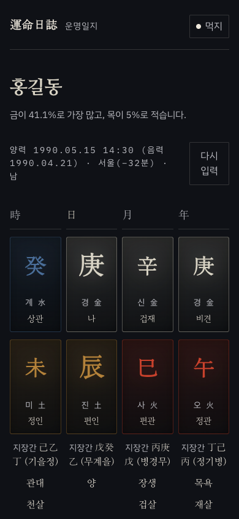
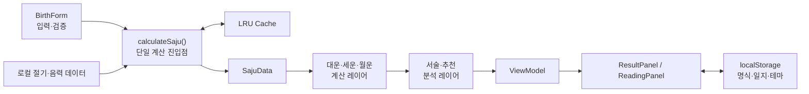

# 운명일지 (un-myeong-il-ji)

> 복잡한 사주 도메인을 결정론적 계산 엔진과 반응형 웹 UI로 구현한 개인 프로젝트입니다.

[배포 앱에서 사용해 보기](https://un-myeong-il-ji.vercel.app)

생년월일시와 출생지를 입력하면 사주 명식부터 대운·세운·월운·일진까지 한 흐름으로 탐색할 수
있습니다. 계산은 서버나 외부 API가 아닌 브라우저에서 수행되며, 같은 입력에는 항상 같은 결과를
돌려주는 것을 가장 중요한 품질 기준으로 삼았습니다.

## 화면 미리보기

<p align="center">
  
  
</p>

## 한눈에 보기

| 구분      | 내용                                                                                    |
| --------- | --------------------------------------------------------------------------------------- |
| 핵심 문제 | 절기 경계, 음력 연도, 진태양시처럼 결과를 바꾸는 경계 조건을 정확하고 결정론적으로 계산 |
| 제품 경험 | 명식 → 대운 → 세운 → 월운 → 목적별 길일을 반응형 인터페이스에서 연속적으로 탐색         |
| 개인정보  | 외부 API와 서버 전송 없이 브라우저에서 계산, 명식과 일지도 `localStorage`에만 저장      |
| 품질 관리 | Vitest 기준 **44개 테스트 파일, 495개 테스트** 통과                                     |
| 설치 경험 | Web App Manifest와 192px·512px 설치 아이콘 제공                                         |

## 기술 스택

| 영역       | 기술                                            | 적용 이유                                                                 |
| ---------- | ----------------------------------------------- | ------------------------------------------------------------------------- |
| 프레임워크 | Next.js 16 App Router, React 19, React Compiler | 클라이언트 중심 계산 앱의 화면·메타데이터·배포 구조를 일관되게 관리       |
| 언어       | TypeScript 5                                    | 천간·지지·오행 같은 도메인 값을 타입으로 제한하고 계산 계층의 계약을 명시 |
| UI         | Tailwind CSS v4, CSS Modules, Radix UI, motion  | 반응형 레이아웃, 키보드 접근성, 모션 감소 설정, 데이터 시각화 구현        |
| 상태·입력  | Zustand, React local state, 도메인 검증 함수    | 테마 상태와 입력·선택 상태를 수명과 책임에 따라 분리                      |
| 날짜 계산  | date-fns, date-fns-tz                           | 출생지 경도와 한국의 역사적 표준시를 반영한 진태양시 계산                 |
| 테스트     | Vitest, jsdom, Testing Library                  | 계산 엔진, ViewModel, 사용자 인터랙션을 콜로케이션 테스트로 검증          |

## 왜 만들었나

사주 서비스의 신뢰도는 화려한 문장보다 **같은 입력에 같은 명식과 점수를 돌려주는가**에서
시작한다고 생각했습니다. 실제 초기 코드에는 대운·세운·월운 점수가 조회할 때마다 바뀌거나,
절입 당일의 월주와 설 이전 양력 날짜의 음력 연도가 잘못 계산되는 문제가 있었습니다.

이 프로젝트에서는 화면을 만드는 데서 멈추지 않고 다음 원칙으로 계산 엔진과 제품을 함께
개선했습니다.

- 근사 날짜가 아닌 실제 절기 timestamp를 사용합니다.
- 계산과 서술, 도메인 데이터와 프레젠테이션 ViewModel을 분리합니다.
- 미검증 데이터는 확정값처럼 노출하지 않습니다.
- 발견한 버그는 재현 이유가 드러나는 회귀 테스트로 고정합니다.

## 주요 기능

### 입력과 명식

- 이름, 출생지, 양력·음력·윤달, 성별, 시·분 입력
- 12시진 선택과 시간 미상 입력 지원
- 출생지 경도와 역사적 표준시를 반영한 진태양시 보정
- 사주 4기둥, 천간·지지·십성·지장간, 오행 분포, 신강신약, 격국·성패, 용신, 신살 표시
- 십이운성·십이신살과 지지 관계(합·충·형·해) 해설

### 여섯 개의 분석 탭

- **명식** — 격국과 성패, 지장간 세력, 지지 관계, 이름 오행과 조건부 오격 성명학
- **인생** — 총평·직업·재물·건강·애정과 두드러진 십성 기반 성격 해석
- **흐름** — 대운 선택에 연동되는 세운·월운과 결혼·이직·창업 등 목적별 시기 조언
- **직업** — 발달 오행과 용신을 결합한 직군 적성, 대표 역할, 준비 역량, 업무 환경 안내
- **오늘** — 일진·건제십이신·시간대별 조언, 목적별 월간 길일 달력, 날짜별 개인 기록
- **방위** — 오행과 용신을 바탕으로 한 방향·공간별 풍수 조언

### 제품 기능

- 브라우저에 여러 명식을 저장하고 다시 불러오기
- Web Share API 지원 환경에서는 결과 요약 공유, 미지원 환경에서는 클립보드 복사
- 상대방 입력 폼을 재사용한 궁합 분석
- 사주 용어를 화면에서 바로 확인하는 용어집
- 라이트·다크 테마와 OS의 `prefers-reduced-motion` 설정 반영
- Web App Manifest와 설치 아이콘을 통한 홈 화면 설치 메타데이터 제공

## 아키텍처



- **단일 진입점** — `calculateSaju()`가 음력 변환, 진태양시 보정, 사주팔자 계산을 거쳐
  십성·신살·신강신약·격국·용신까지 조합한 `SajuData`를 반환합니다.
- **계산과 서술 분리** — `dae_un.ts` 같은 모듈은 간지를 계산하고, `daeun_analysis.ts` 같은
  모듈은 계산 결과를 사용자 문장으로 변환합니다. 세운·월운도 같은 경계를 따릅니다.
- **ViewModel 패턴** — UI 컴포넌트가 `SajuData`를 직접 가공하지 않도록 순수 ViewModel 계층을
  두어 계산 로직과 렌더링을 독립적으로 테스트합니다.
- **클라이언트 전용 계산** — API Route가 없고 생년월일시를 서버로 전송하지 않습니다. 명식과
  일지 역시 브라우저 저장소 밖으로 나가지 않습니다.
- **연도별 데이터 샤딩** — 절기표와 음력 변환표를 연도 구간으로 분리하고
  `unified_data_query.ts`를 단일 조회 파사드로 사용합니다.

## 프론트엔드 설계 포인트

- 좁은 화면에서 명식 4기둥의 행 높이가 달라지던 문제를 CSS `subgrid`로 해결해 문자열 길이가
  바뀌어도 천간·지지·지장간 행이 구조적으로 정렬되도록 했습니다.
- Radix UI의 Tabs·Toggle·Tooltip을 조합해 포커스 이동과 `aria-*` 상태를 유지하고, 스크롤 가능한
  탭에는 좌우 페이드 힌트를 추가했습니다.
- motion의 `staggerChildren`으로 등장 순서를 한곳에서 관리하고 `MotionConfig`의
  `reducedMotion="user"` 설정으로 사용자의 모션 감소 설정을 앱 전체에서 존중합니다.
- 대운 → 세운 → 월운 → 시기 조언의 선택 상태를 하나의 캐스케이드로 연결해 상위 시점을 바꾸면
  모든 하위 분석이 같은 기준 시점으로 갱신됩니다.
- 무거운 해석 계산은 ViewModel과 `useMemo` 경계에 두어 테마 토글 같은 표현 상태 변경으로 다시
  실행되지 않게 했습니다.

## 문제 해결 사례

### 조회할 때마다 운세 점수가 달라짐

- **증상** — 동일한 생년월일시를 다시 입력해도 대운·세운·월운의 세부 점수가 달라졌습니다.
- **원인** — 분석 모듈이 `Math.random()`으로 점수를 만들고, 대운 순역을 계산하는 구현도 두 곳에
  중복되어 서로 다른 결과를 냈습니다.
- **해결** — 기간 천간의 십성과 육친 관계에서 점수 변화량을 결정론적으로 유도하고, 대운 계산은
  `calculateDaeUn()` 하나에 위임했습니다.
- **검증** — 같은 입력을 반복 계산해 전체 결과가 동일한지, 음남·양녀의 역행 대운이 계산
  레이어와 서술 레이어에서 일치하는지 회귀 테스트로 고정했습니다.

### 달력 경계에서 연주·월주·음력 날짜가 어긋남

- **증상** — 절입 당일의 월주, 입춘 직전의 연주, 설 이전 양력 날짜의 음력 연도가 경계 전후에서
  잘못 표시됐습니다.
- **원인** — ±1일 오차가 있는 고정 절기표와 양력 연도를 그대로 재사용하는 음력 역변환 로직이
  경계 조건을 표현하지 못했습니다.
- **해결** — 실제 절기 timestamp와 보정된 출생 순간을 기준으로 연주·월주를 계산하고, 음력
  변환은 변환된 음력 연도·월·일을 하나의 결과로 유지했습니다.
- **검증** — 절입 직전/직후, 입춘 직전, 설 이전 양력 날짜의 왕복 변환을 각각 테스트합니다.

<details>
<summary>같은 시각이라도 출생지에 따라 시주가 달라지는 진태양시 보정</summary>

한국 표준시는 동경 135°를 기준으로 하므로 서울과 부산의 같은 출생 시각은 태양시 기준으로 서로
다른 시진에 속할 수 있습니다. 입력 폼의 출생지를 경도표와 연결하고, 역사적 서머타임을 포함한
한국 표준시를 적용한 뒤 경도 차이를 분 단위로 보정합니다. 도시 변경이 캐시에서 누락되지 않도록
출생지도 계산 캐시 키에 포함합니다.

</details>

### 화면의 추천과 계산 점수가 서로 다름

- **증상** — 월간 길일 달력에서 낮은 점수의 날짜가 하단 추천 날짜로 표시될 수 있었습니다.
- **원인** — 달력 셀과 추천 문구가 서로 다른 경로에서 날짜를 선택했습니다.
- **해결** — 한 달의 모든 후보를 동일한 목적별 점수 함수로 계산하고, 점수 내림차순으로 정렬한
  최상위 날짜를 추천 문구에서도 그대로 사용합니다.
- **검증** — 추천 날짜가 달력의 최고점 그룹에 포함되고 표시 점수와 추천 점수가 일치하는지
  목적별 회귀 테스트로 확인합니다.

### 직업 추천이 사용자의 강점을 감점함

- **증상** — 특정 오행이 발달한 사용자에게 오히려 해당 분야의 직업 점수가 낮게 나왔습니다.
- **원인** — 용신 일치만 강조하면서 발달 오행을 과다 요소로 보고 감점했습니다. 별도의 직업
  매칭 엔진은 화면과 다른 용신 구현을 다시 계산하고 있었습니다.
- **해결** — 발달 오행의 강점 점수와 용신의 보완 점수를 결합하고, 화면에서 확정한 용신을 직업
  매칭 엔진에 주입해 단일 기준을 사용합니다.
- **검증** — 오행별 적성 점수, 직군 병합, 용신 override를 단위 테스트로 검증합니다.

<details>
<summary>미검증 데이터를 확정처럼 보여주지 않는 원칙</summary>

조후용신 120칸 표와 원획법 한자 사전은 항목별 검증 플래그를 가집니다. 복수 근거가 일치한 값만
확정 신뢰도로 사용하고, 한자 획수를 확인할 수 없으면 임의 숫자를 만들지 않고 오격 분석을
`available: false`로 반환합니다.

</details>

## 테스트 전략

```text
Test Files  44 passed (44)
Tests      495 passed (495)
```

- 계산 모듈과 테스트를 같은 디렉터리에 두는 콜로케이션 방식을 사용합니다.
- 테스트 이름에 산식 근거와 회귀 사유를 남겨 실패 시 어떤 도메인 규칙이 깨졌는지 알 수 있게
  합니다.
- 절기 전후, 시간 미상, 출생지 보정, 음력 왕복 변환처럼 한 글자의 간지를 바꾸는 경계를 우선
  검증합니다.
- 순수 ViewModel 테스트와 Testing Library 기반 컴포넌트 테스트로 계산 결과뿐 아니라 탭 전환과
  브라우저 저장 같은 사용자 동작도 확인합니다.
- 완료 전 `pnpm test`, `pnpm typecheck`, `pnpm lint`를 공통 품질 게이트로 사용합니다.

## 기여 범위

`src/lib`, `src/data`, `src/types`, `src/utils`는
[hjsh200219/fortuneteller](https://github.com/hjsh200219/fortuneteller)의 MIT 라이선스 코드를
출발점으로 삼았습니다. 원본과 라이선스 전문은 [THIRD_PARTY_NOTICES.md](THIRD_PARTY_NOTICES.md)에
명시했습니다.

그 위에서 직접 수행한 작업은 다음과 같습니다.

- 계산 엔진의 결정론·절기 경계·음력 변환·진태양시·격국·용신·신강신약 오류 수정
- 오행 분포, 십이운성, 십이신살, 격국 성패, 조후용신, 목적별 길일 등 신규 계산 모듈 추가
- Next.js UI와 ViewModel, 반응형 레이아웃, 접근성 인터랙션, 브라우저 저장 기능 설계·구현
- upstream에 없던 테스트 체계를 구축하고 44개 파일 495개 회귀 테스트 작성

스캐폴드 커밋 이후 현재 상태의 Git diff 기준으로 계산·데이터·타입 계층은 **+10,992 / −3,172줄**,
UI·ViewModel 계층은 **+8,029 / −1,516줄**을 변경했습니다. 줄 수 자체보다 원본 코드와 직접 개선한
범위를 투명하게 구분하기 위한 참고 수치입니다.

## 개발 프로세스

`docs/AI_AGENT_GUIDE.md`를 프로젝트 아키텍처와 도메인 함정의 단일 문서로 관리합니다. Codex와
Claude Code는 각각 짧은 진입 문서를 통해 같은 가이드를 읽고, 근사·정밀 함수의 혼용이나 경쟁하는
용신 구현처럼 반복되기 쉬운 문제를 먼저 확인합니다.

AI가 만든 결과를 그대로 수용하는 방식이 아니라 다음 순서로 사용합니다.

1. 실제 코드와 기존 테스트를 먼저 조사합니다.
2. 계산 공식은 기존 단일 진입점과 데이터 파사드를 재사용합니다.
3. 수정 이유가 드러나는 회귀 테스트를 추가합니다.
4. 전체 테스트·타입 검사·린트로 결과를 검증합니다.

## 로컬 실행

```bash
pnpm install
pnpm dev        # http://localhost:3000
pnpm test       # Vitest 전체 테스트
pnpm typecheck  # next typegen && tsc --noEmit
pnpm lint
pnpm build
```

Node.js 20 이상과 pnpm 10 이상을 사용합니다. 환경 변수와 외부 API 키는 필요하지 않습니다.

## 한계와 다음 과제

- 명식과 일지는 브라우저에만 저장되므로 다른 기기와 동기화되지 않습니다.
- Web App Manifest와 설치 아이콘은 제공하지만 오프라인 캐시를 위한 Service Worker는 아직 없습니다.
- 일부 유파 해석기와 `src/tools`의 재사용 가능한 핸들러는 현재 화면·API 경로에 연결하지 않았습니다.
- 사주와 길일 해석은 참고 정보이며 의료·법률·재무 등 전문적 의사결정을 대체하지 않습니다.

## 라이선스

서드파티 코드의 출처와 MIT 라이선스 조건은
[THIRD_PARTY_NOTICES.md](THIRD_PARTY_NOTICES.md)를 참고하세요.
